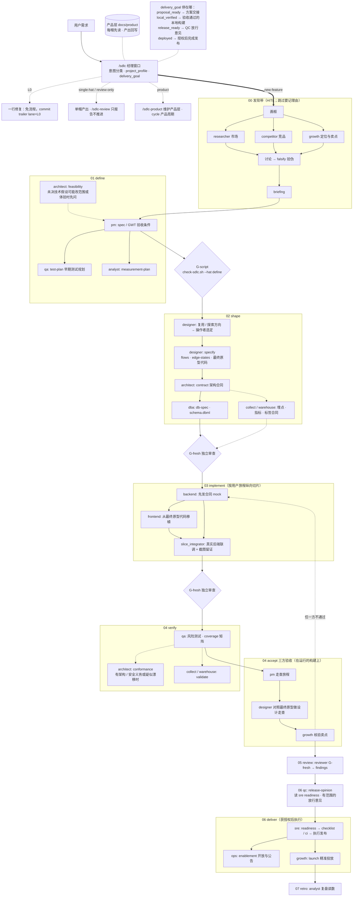

# sdlc-workflow

ZCode 插件 · v4.1.0 · MIT

闸门化的功能交付控制面：把「一个功能从想法到交付」变成以产品质量为目标的流水线——发现带（市场 ∥ 竞品 ∥ 增长定位）先行，技术可行性在冻结范围前先问，体验设计与最终原型先于架构合同，按用户旅程纵向切片实现并联调，E2E 与三方验收把关，产出回写产品层。每一步的结论都落在磁盘工件上，由脚本闸门与独立上下文审查判定，不靠口头汇报。

每次运行先记录**做到哪一步**（`delivery_goal`：proposal_ready / local_verified / release_ready / deployed）与项目画像，按任务派单；范围小就如实记「已完成的任务 + 尚未进行的阶段」，不把未做的实现与发布算作完成。

## 核心机制

| 机制 | 说明 |
|---|---|
| 经理窗口 + 角色帽 | `/sdlc` 父会话只做意图分类、派单与记账；具体工作全部派给 19 个专职角色子代理（独立上下文） |
| 产品层 | `product_root`（默认 `docs/product`）承载产品的长期记忆：策略、功能地图、增长、设计系统、架构、领域模型与数据；每个帽先读、产出回写 |
| 泳道 L0–L4 | 按风险分级流程重量（一行修复免流程 → 标准功能链 → 放行/交付 → 数据线），参与角色由判定问题决定而非固定名单 |
| 范围与完成目标 | `project_profile`（形态、技术栈、成熟度、数据/安全/发布约束）与 `delivery_goal` 决定这一趟做哪些任务；闸门只对声明完成的泳道有效，不为缩小的范围背书 |
| 早期可行性 | 未决技术假设可能改变范围或体验时，先派 architect `define/feasibility` 回答问题，不要求先有完整 spec；结论回流 PM 与设计 |
| 写入归属 | 注册表按任务标 `writes_source` / `requires_source`，生产代码只能写进显式列出的 `source_writes` 路径；派单包里的每个输出字段（交付物、产品文件、记忆、信号库）都按真实路径（解析符号链接与 `..`）和拥有者校验，位于某个目录内不等于有权写 |
| 证据分级 E0–E4 | 研究与结论按证据形态分级（未证实 → 断言 → 可查工件 → 有口径的计数 → 已执行的测试），不以来源数量充数；缺来源即「未知」，不许编链接 |
| 结构图与生成图 | 结构（流程/ER/架构）用 SVG 出图并对照权威来源做语义比对；位图素材（方向参考、空态插画、hero、图标）由 Grok 出图，按订阅授权调用，每张图留提示词与 digest。生成图不算渲染产物，也不算走查截图 |
| 脚本闸门 G-script | `check-sdlc.sh` 以工件文件与内容判定各阶段是否可过，退出码即结论 |
| 独立审查 G-fresh | 审查者是无记忆的新上下文子代理，只看磁盘工件、无写权限、不读生产者推理过程 |
| 旅程切片与联调 | 实现按可演示的用户旅程切片，前端从验收过的最终原型代码移植（不是照着截图重画），UI 切片须在真实后端上走通并截图留证 |
| 三方验收 | PM 走查旅程、设计走查对照原型、增长核验卖点，任何一方不通过即返工 |
| 验证与放行分开 | QA 早期就参与测试规划；QC 给的是有范围的放行意见，不等于部署授权；SRE 先做 QC 前的就绪准备，获授权后才执行发布 |
| 状态账本 | 每个功能一份 `state.yaml`：目标与画像、当前阶段、已选任务、闸门记录、返工轮数；会话中断后从它恢复 |
| 产品周期 | `/sdlc-product cycle <id>` 在功能泳道之外跑持续运营：ops 汇总用户信号进产品级信号库、analyst 读数、growth 实验、pm 逐条决定、按需刷新标签；周期有自己的目录与 `cycle.yaml`，关闭前逐项交代去向 |
| 职能视图 | 19 个角色按产品 / 运营 / 设计 / 研发 / 质量分组，`function-map.md` 从注册表生成；分组不带任何权限。项目可在 `owners` 里写每个职能该问谁，经理提问时点名，回答仍以会话里记录的原话为准 |
| 项目经验 | 在项目里核实过的坑（代码与测试、逃逸编号、闸门命令与退出码）由经理记进项目自己的 `.sdlc/_lessons.md`；插件的做法只保留跨项目成立的原则 |
| 影响查询 | `workflow.py trace <ID>` 只读地列出一个 ID 的定义、上下游、验证记录与缺口；功能内的短 ID 按功能区分，状态只取自覆盖矩阵与证据记录 |

## 流程图

阶段与任务的唯一事实源是 `workflow/registry.json`；下图是 L2+ 标准功能链的常见走法，菱形是闸门，虚线是条件分支。



## 工作流程

一次 `/sdlc` 的完整走法。经理窗口只做分类、派单、闸门与记账，所有专业工作都在独立上下文的角色子代理里完成。

### 0. 开工前（经理窗口自己做）

1. 读项目根的 `sdlc.config.yaml`（没有就复制模板，让用户补齐闸门命令、`app.start` / `app.base_url`、`product_root`），跑 `check_config.py` 体检；阻断项交还用户改，经理不代改配置。
2. 落实产品层 `product_root`（缺文件从模板补，不覆盖）。产品层大面积空白且产品已存在 → 先建议 `/sdlc-product`。
3. 有未完成的 `state.yaml` → 判为 `resume`，从 `current_hat` 接着走。

### 1. 意图分类（派单之前）

以用户最近一条实质性消息判类，写进 `state.yaml` 的 `intent`：

| 类别 | 经理动作 |
|---|---|
| `L0` | 一行修复：不起流程、不写 state，只加 commit trailer `lane=L0` |
| `single-hat` | 「写个 PRD」「只设计这一屏」：派一个帽，不起泳道、不做 G-fresh |
| `review-only` | 只审查、只报告，不推进进度 |
| `product` | 建或刷新产品层 |
| `discovery` | 「先调研 / 先讨论」，或有未决产品判断 → 走发现带 |
| `new-feature` | briefing 已 done/skipped → 进泳道 |
| `eval` / `out-of-slice` | 评测另开窗口；组织级流程、CI 平台、on-call 等超范围请求直接拒绝并说明边界 |

### 2. 泳道与参与判定

风险问题 **Q1** 动表结构？**Q2** 认证/租户？**Q3** 对外合同？**Q4** 不可逆？**Q5** 新依赖？**Q6** 文件数超阈值（默认 20）或跨 2 个以上子项目？ → 定 L0–L4，命中 Q2/Q3/Q4 则 `q_security: yes`。
参与问题 **Q-ui**（有用户可见界面）与 **Q-tracking**（新增或变更埋点指标）写进 state，决定设计师与数据帽是否参与。跳过任何角色都要写理由，且不因此减少该阶段的工件要求。

同时记 `project_profile` 与 `delivery_goal`：这一趟是出方案、跑通本地、准备放行，还是要完成发布。

### 3. 派单包 v2（唯一的派单形式）

三个 feature 试点（PM spec、architect conformance、backend T-n）使用 `prepare → seal → record → check-tasks` 和封存的 SPAWN PACKET v3，详见 [任务协议](skills/sdlc/references/task-protocol.md)。其余任务沿用 SPAWN PACKET v2（帽子、阶段、任务、输入文件、可搜索目录、交付路径、证据要求、`product_context` / `product_writes` / `source_writes`、成功检查、禁止事项），存到 `<feature>/packets/`，派单前先跑 `check_packet.py`。它会拦掉常见偷工：把调研写成「可选」、证据清单比合同短、交付物写到功能目录外、给帽子不属于它的写权限。合同本身用 `workflow.py contract --role … --stage … --task …` 现查，不靠记忆。

### 4. 阶段与产出

| 阶段 | 谁做什么 | 主要工件 |
|---|---|---|
| 00 发现带 | 画框 → researcher 市场 ∥ competitor 竞品 ∥ growth 定位 → 讨论 → falsify 验伪 → 冻结 | `00-discover/{market,compete,growth}.md`、`briefing.md` |
| 01 define | pm 写 spec 与 GWT 验收条件；qa 早期测试规划；analyst 度量方案；未决技术假设先派 architect 可行性 | `01-define/spec.md`、`test-plan.md`、`measurement-plan.md`、`architecture-feasibility.md` |
| 02 shape | designer 复用或探索方向 → 操作者选定 → specify（流程、6 态矩阵、令牌、文案、最终原型代码）→ architect 架构合同 → dba 模型与迁移；数据线按需接入 collect / warehouse | `02-shape/design-directions.md`、`flows.md`、`edge-states.md`、`prototypes/final/`、`contract.md`、`db-spec.md`、`schema.dbml` |
| 03 implement | 按用户旅程纵向切片，每票指定一个 `slice_integrator`；后端先发合同 mock，前端据此并行并从最终原型代码移植，最后在真实后端上联调并截图 | `03-impl/T-<n>-<role>-evidence.md`、`T-<n>-integration.md` |
| 04 verify | qa 按风险跑测试出覆盖矩阵；有架构/安全义务或疑似漂移时 architect 做一致性核对；数据线做回流校验 | `04-verify/coverage.md`、`architecture-conformance.md`、`collect-validation.md` |
| 04 accept | 在运行的构建上三方验收：pm 走查旅程 ∥ designer 对照最终原型 ∥ growth 核验卖点 | `04-verify/accept-{pm,design,growth}.md` |
| 05 review | reviewer 独立审查（无记忆新上下文，只读磁盘工件） | `05-review/findings.md` |
| 06 qc / deliver | sre 先做就绪准备 → qc 给有范围的放行意见 → 获授权后 sre 执行发布，ops 开放公告、growth 投放 | `06-deliver/readiness.md`、`release-opinion.md`、`checklist.md`、`enablement.md`、`launch.md` |
| 07 retro | analyst 按真实数据复盘 | `07-retro/retro.md` |
| 周期（产品层） | 不属于某个功能：ops 信号汇总 → analyst 读数 → growth 实验 → pm 决定；数仓按需刷新标签 | `.sdlc/_product/cycles/<id>/cycle.yaml`、`outputs/*.md`、信号库 |

### 5. 三类闸门

- **任务检查**：每个任务返回后跑 `workflow.py check-task` 的存在性检查 + 该做法自己的检查；单个任务通过不等于阶段完成。
- **G-script**：配置里的 test / lint / build / migration / e2e，加 `check-sdlc.sh --require --hat <stage>`。E2E 用 `evidence.py run` 跑，闸门记录必须带绑定代码版本的运行记录——「帽子说通过」不算，`state.yaml` 里写 pass 也不算。
- **G-fresh**：每阶段所有产出帽返回后一次（define / shape / implement），验收后再来一次终审。审查者不读生产者的推理过程，只看工件；blocker 或未豁免的 major → 原帽返工，阶段不前进。

### 6. 人工决策点（经理呈现，人决定）

发现带冻结 · 设计方向选定（`ui: yes` 且需要新方向时）· 战略问题（`Q-*` 类别为战略）· 验收「有条件通过」的取舍。战略问题一轮问完并**等**：沉默、没送达的提问、工具没返回都不算同意；没答案就 `phase: Stopped`，依赖它的阶段不开工。帽子擅自给战略问题填默认值（`DEFAULTED`）算返工，不是通过。配置了 `owners` 时，经理在提问里点名该由谁决定；他人决定、由你转达的回答另记 `decided_by`、`relayed_by` 与授权来源——闸门只核对记录的原话，不核验身份。

### 7. 状态、返工与恢复

`state.yaml` 是进度唯一事实源：目标与画像、当前阶段、已选任务与依赖、闸门记录、验收结论、战略问答原话、失效工件、返工轮数。子代理不共享聊天记录，全靠磁盘工件接力；上游改动会把下游工件标 `stale` 并重跑对应闸门。同一帽第 2 轮返工起附带 debug 协议并记一行根因；define 或 shape 返工 ≥3 轮判为系统性问题，停下来找人。会话中断后重开窗口 `/sdlc continue` 即从 `state.yaml` 续跑。

## 使用方法

### 安装（只以引用方式使用）

同一份 skills / commands / agents 支持四个宿主，依赖 bash 与 python3。先克隆本仓库并运行 `bash vendor/install.sh` 拉上游原件，自检 `bash scripts/health-check.sh` 应全绿。下文 `<PLUGIN_ROOT>` 指插件目录（或指向它的符号链接）。

**所有宿主只能引用这一份目录，不许复制。** 会复制插件的命令一律不用：`claude plugin install`（写缓存副本）、`grok plugin install`（留哈希副本）、`codex plugin add`（装副本且丢弃符号链接）。副本会和源头悄悄分叉。

| 宿主 | 引用方式 | 命令 | 角色子代理 |
|---|---|---|---|
| ZCode | 插件目录本身就是 `~/.zcode/local-plugins/sdlc-workflow`（克隆或链接），在 ZCode 中启用（读 `.zcode-plugin/`） | `/sdlc` 等 7 个 | 原生 `sdlc-workflow:<角色>` |
| Claude Code | 只改设置：`extraKnownMarketplaces` 登记 `directory` 源 `<PLUGIN_ROOT>`（项目设置可用相对路径，用户设置用绝对路径），`enabledPlugins` 打开 `sdlc-workflow@sdlc-workflow`；原地加载，不执行 install | `/sdlc` 等（重名时 `/sdlc-workflow:sdlc`） | 原生，清单显式列出 19 个 |
| Grok | 符号链接：受信任项目的 `.grok/plugins/sdlc-workflow`（并在 `.grok/config.toml` 的 `[plugins].enabled` 列出），或 `~/.grok/plugins/sdlc-workflow`；也可用 `[plugins].paths`（读 `.grok-plugin/`） | `/sdlc` 等 | 原生 `sdlc-workflow:<角色>` |
| Codex | `python3 <PLUGIN_ROOT>/scripts/link-codex.py --project <项目根>`：`<项目根>/.codex/skills/sdlc-workflow` 链到 `skills/`，角色 TOML 链进 `<项目根>/.codex/agents/`，只在该项目生效（与 `.claude/` 一样）；不带 `--project` 则链进 `~/.codex/`，所有项目共用；`--check` 核对、`--remove` 撤销 | 无插件命令：用 `$` 或 `/skills` 选 `sdlc-workflow:sdlc`，在请求里写 `mode: product` 等，对照表见 `skills/sdlc/references/hosts.md` | 链接后为 `sdlc-workflow-<角色>`；未链接时经理回退到 `default` |

经符号链接调用脚本时（例如 `<仓库>/.agents/plugins/sdlc-workflow/scripts/link-codex.py`），链接会经过那条路径，便于统一由项目的插件中枢管理。各宿主的清单都由 `adapters/hosts.json` 生成（`python3 scripts/workflow.py render`），不要手改；`.codex-plugin/` 与 `.agents/plugins/marketplace.json` 只供对外分发，本机不用。宿主差异与实测依据见 `adapters/HOST-NOTES.md`。

### 接入一个项目（一次性）

1. 复制 `skills/sdlc/templates/sdlc.config.yaml` 到项目根，填 `gates`（test / lint / build / migration / e2e）、`app.start` 与 `app.base_url`（多界面填 `app.urls`）、`product_root`、`constitution`、`lane_rules` 路径规则。有 UI 的项目 `e2e` 不允许为 null。
2. `python3 <PLUGIN_ROOT>/scripts/check_config.py --project-root .` 体检，按提示补齐。
3. `/sdlc-product 全部` 建产品层——它会派 pm → （战略问题问你）→ architect ∥ designer → dba → 数据帽 → growth，把策略、功能地图、设计系统、架构、领域模型与数据写成真文件。这一步之后每个功能才有「先读的记忆」。

### 日常用法

| 想做的事 | 怎么做 |
|---|---|
| 做一个功能 | `/sdlc <需求一句话>`，按提示在决策点回答 |
| 先摸清楚再决定 | `/sdlc 先调研 <方向>` 或 `/sdlc-discover <想法>` |
| 只要调研报告，不想被追问 | `/sdlc-research <要调研的变更>` |
| 续上被打断的功能 | 新窗口 `/sdlc continue` |
| 已有工件找人独立挑错 | `/sdlc-review <功能目录或工件路径>` |
| 刷新产品层的某几块 | `/sdlc-product strategy feature-map` |
| 走短路径（已有合同或以 spec 代合同） | `/sdlc 短路径 <需求>`，仍需满足 L2-short 谓词 |
| 一行修复 | 直接说「改个错别字，不要走流程」，经理判 L0 |
| 评测插件本身 | 另开窗口 `/sdlc-eval <skill> <mechanical\|rubric\|regression>`（烧真实模型调用，人工触发） |
| 开通出图能力 | `/sdlc-grok login` 用 Grok 订阅授权 → `/sdlc-grok probe` 确认这个档位真能出图 → 在项目 `sdlc.config.yaml` 把 `imagery.enabled` 设为 true |
| 跑一轮产品周期 | 先在 `sdlc.config.yaml` 设 `signals_path`（信号库目录），再 `/sdlc-product cycle 2026-10`；收尾时经理跑 `check-sdlc.sh --hat cycle` |
| 查一个 ID 牵动了什么 | `python3 scripts/workflow.py trace FR-3 --feature .sdlc/<功能>`；产品级 ID 用 `--project-root .`（如 `metric:<id>`、`SIG-202610-4`） |
| 看自己的职能管哪些任务 | 读 `skills/sdlc/references/function-map.md` |

### 单独召唤做法技能

不挂 `/sdlc` 时，27 个做法可以用 `$名称` 直接召唤（`$falsify` 是 discover 方法的兼容入口，2026-12-31 退役），例如 `$prd-gwt` 写 spec、`$schema` 出库表设计、`$coverage-matrix` 出覆盖矩阵、`$debug` 走排障协议、`$tdd` 做测试先行。此时没有泳道与 G-fresh，产出质量由做法本身的标准保证。

### 交回来的东西在哪

- 功能工件：`.sdlc/<feature>/`，按 01-define → 07-retro 分目录，附 `state.yaml`、`packets/`、`evidence/runs/`。
- 产品层：`<product_root>/`（默认 `docs/product`），跨功能长期有效。
- 想知道某个任务要交什么：`python3 scripts/workflow.py contract --role <角色> --stage <阶段> --task <任务>`。

### 用之前知道这些

- 经理窗口不写任何专业工件；要它直接改代码就等于绕过流程。
- 战略决策永远回到你手上，插件不替你拍板；你不答，流程就停在那里等。
- 闸门只保证下限（工件在、命令过、审查过），产品好不好仍取决于发现带与设计阶段的判断。
- 帽子只能写它被授权的路径：功能工件、它拥有的产品文件、显式列出的 `source_writes`。
- 跳过角色不会减少阶段要求，只会在 state 里留下一条要交代的理由。

## 角色与做法

19 个角色（`agents/`）：pm、researcher、competitor、growth、architect、dba、designer、frontend、backend、algo、miner、qa、reviewer、qc、sre、ops、analyst、data-collector、data-warehouse-engineer。角色定义身份、责任边界与红线，由 `profiles/` 与共享行为栈编译生成。

27 个做法（`skills/`）以产出物命名（prd-gwt 产出 spec、schema 产出 db-spec、coverage-matrix 产出覆盖矩阵……），承载各专业的步骤与卓越标准。每个做法在注册表里登记类型（经理用 manager、角色主方法 role、实践方法 practice、兼容入口 compat）。角色与做法的多对多映射、任务的运行范围（功能 / 产品 / 周期）与生命周期阶段、任务级工件路径、阶段等级、源码与产品写权限的唯一事实源是 `workflow/registry.json`，速查视图由其生成；角色按任务而非头衔接活，同一个帽在不同任务上的授权与产出各不相同（如 architect 的 feasibility / contract / change-impact / conformance）。

## 目录结构

```
sdlc-workflow/
├── commands/        入口命令（生成产物）
├── agents/          19 个角色（生成产物；源在 profiles/ 与 _lib/）
├── skills/          27 个做法：SKILL.md + references/ + templates/ + evals/
├── workflow/        registry.json：命令路由、角色任务、工件路径、阶段合同
├── adapters/        hosts.json（插件身份与宿主设置的唯一来源）、宿主工具档、MCP 白名单、宿主事实、codex/agents（生成）
├── scripts/         闸门、健康检查、角色工厂、评测评分与一致性测试
├── vendor/          上游原件：仓库只含 install.sh 与锁文件，内容由使用者从源头下载
├── maintainers/     维护者档案（不被任何 skill 加载），例如待项目方接收的项目经验归档
├── .zcode-plugin/ .claude-plugin/ .grok-plugin/ .codex-plugin/   各宿主插件清单（生成）
└── .agents/plugins/ Codex 本地市场（生成）
```

`commands/`、`agents/*.md`、各宿主清单与角色速查表均为生成产物，不手改；数据与源文件的唯一维护位置见 `workflow/registry.json` 与 `agents/profiles/`。

## 项目侧配置与工件

- `sdlc.config.yaml`（项目根）：闸门命令、项目红线宪法路径、MCP 提醒清单、泳道阈值
- `<product_root>/`：产品层
- `.sdlc/<feature>/`：功能工件树（01-define → 02-shape → 03-impl → 04-verify → 05-review → 06-deliver → 07-retro）+ `state.yaml` + `evidence/runs/`（绑定代码版本的运行记录）+ 各角色运行时记忆
- `.sdlc/_product/`：产品模式的进度与派单包；`cycles/<id>/` 是每个产品周期（`cycle.yaml`、`outputs/`、`packets/`、`memory/`）
- `signals_path` 指向的信号库：跨功能的用户信号，只有 ops 的周期汇总能写，每条一个稳定的 `SIG-<年月>-<n>`
- `.sdlc/_lessons.md`：本项目核实过的坑与逃逸记录

## 质量保障

| 工具 | 职责 |
|---|---|
| `scripts/check-sdlc.sh` | 阶段工件闸门（存在性 + 内容语义）；`--hat product` 查产品层，`--hat cycle` 查产品周期收尾 |
| `scripts/health-check.sh` | 插件结构门禁：描述形态、预算上限、生成产物与源一致、防回归规则 |
| `scripts/workflow.py` | 合同查询 / 任务级检查 / 生成 commands 与速查表 |
| `scripts/check_config.py` | 开工前体检项目 `sdlc.config.yaml`（闸门命令、`app` 启动与 base_url、`product_root`），只读不改 |
| `scripts/check_packet.py` | 派单前 lint 派单包：输入齐备、不许把调研与证据写成「可选」、所有输出字段按真实路径与拥有者校验 |
| `scripts/sdlc_trace.py` | `workflow.py trace` 的实现：每次从工件重建只读索引，不写任何文件 |
| `scripts/check_research_sources.py` | 只查带日期的 URL / 本地工件引用是否存在，不评判研究质量、不设来源配额 |
| `scripts/evidence.py` | 把测试与验证的运行记录绑定到当时的代码版本（`state.yaml` 写「pass」不算证据） |
| `scripts/diagram/` | 图示闸门：来源声明、安全检查、节点与边对照权威来源的语义比对 |
| `scripts/image/` | 出图与它的闸门：生成位图素材并留证（提示词原文、模型、参数、digest），`check.py` 把每张图绑到提示词与声明它的工件上 |
| `scripts/grok/auth.py` | Grok 订阅授权（OAuth device flow）：登录 / 状态 / 登出；凭据只存 `~/.sdlc/grok/`（0600），任何子命令都不打印 token |
| `scripts/data_dictionary.py` | 由 erd.dbml + 术语表 + metrics.yaml 生成只读数据字典（`--check` 抓过期与手改） |
| `scripts/render-role-agents.py` | 从 profiles 与 _lib 编译角色，同时生成 Codex 角色（`adapters/codex/agents/*.toml`）；`--check` 抓漂移 |
| `scripts/hosts.py` / `scripts/link-codex.py` | 由 `adapters/hosts.json` 生成 ZCode / Claude Code / Grok / Codex 清单与 `hosts.md`（经 `workflow.py render`）；以符号链接让 Codex 引用本插件的 skills 与角色（不复制） |
| `scripts/grade_eval.py` / `blind_eval.py` | 评测机械评分（不调模型）与盲评 |
| `scripts/ui-evidence.sh` | UI 截图留证 |
| `scripts/test_workflow.py` / `test_skill_evidence.py` / `test-check-sdlc.sh` / `test_vendor_install.py` / `test_hosts.py` | 注册表、技能证据规则、闸门、vendor 安装与多宿主打包的自测 |

## 上游原件（vendor/）

本仓库**不分发任何上游内容**：`vendor/` 只提交 `install.sh`、说明和每个来源的锁文件。克隆后运行 `bash vendor/install.sh`，脚本按锁文件从上游源头下载同一个 commit 的同一批文件，校验树摘要一致才落盘；许可证受限的来源默认跳过。来源清单与许可证见 [vendor/README.md](vendor/README.md)。

vendor 里的内容**不会自动变成能力**：宿主不扫描 `vendor/`，插件只通过引用使用它（技能链接、派单输入、脚本调用）。健康检查保证：已安装内容与锁文件一致；runtime 文件确有引用且来自可自由使用的许可证；维护者参考不进入技能；插件内没有副本。

`discover`、`prototype` 是借鉴后改写的派生技能，只在正文注释里记录来源，不跟随上游。

## 许可

MIT（见 [LICENSE](LICENSE)）
