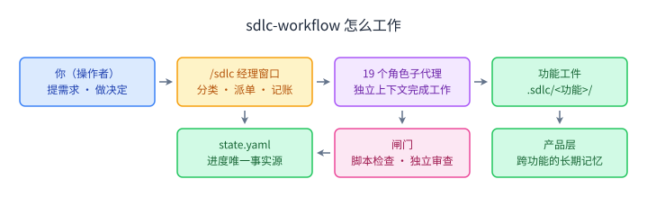
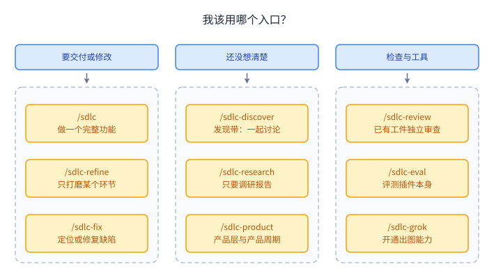
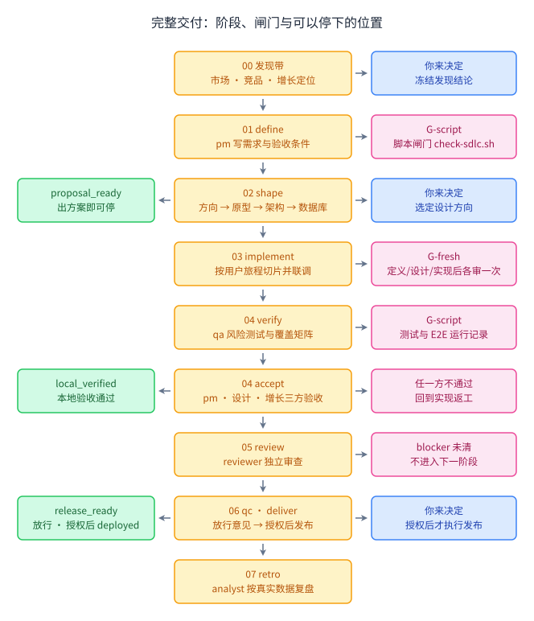
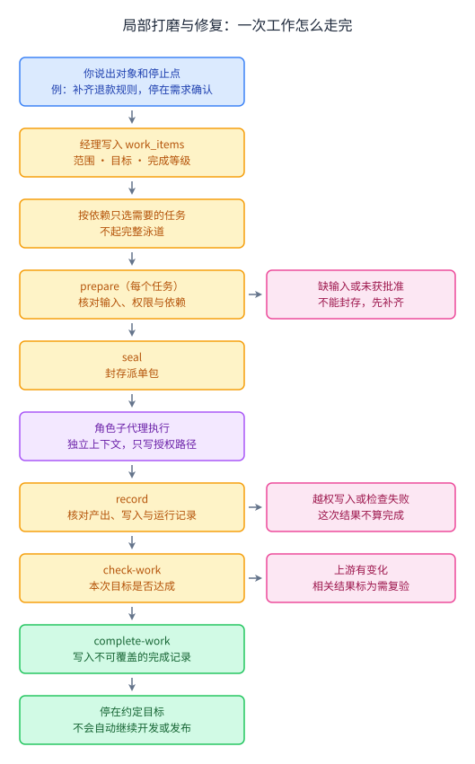
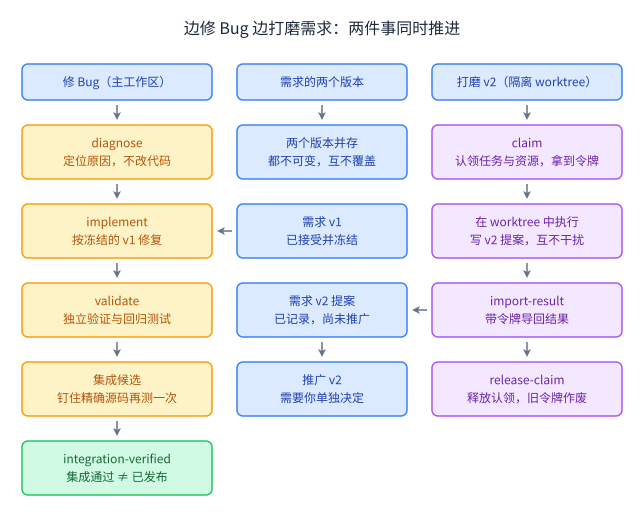
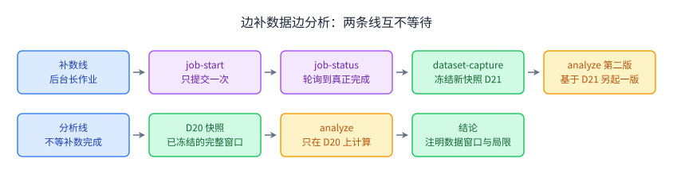

# sdlc-workflow 使用指南

这份指南讲清楚 sdlc-workflow 能做什么、每种场景该怎么说、说完会发生什么、结果在哪里看。第一次用，先读前三节；以后遇到具体场景，直接跳到对应章节。

图中颜色的含义都一样：

| 颜色 | 含义 |
|---|---|
| 蓝色 | 你（或你的决定、你的输入） |
| 橙色 | 经理或角色正在做的一步 |
| 紫色 | 角色子代理、并行执行 |
| 绿色 | 产出、记录和可以停下的位置 |
| 粉色 | 闸门：检查不通过就停下 |

## 1. 一分钟看懂



- **你**：说需求，并在关键处做决定，例如选设计方向、回答战略问题、授权发布。插件从不替你拍板。
- **经理窗口**：你输入 `/sdlc` 的那个会话。它只判断意图、选任务、派单、记账，不亲自写需求、代码或设计。
- **角色子代理**：19 个专职角色，包括 pm、designer、architect、dba、frontend、backend、qa、data-collector、analyst 等。每次都在全新的独立上下文里工作，只能写被授权的路径。
- **闸门**：每个产出都要过检查。
  - 脚本闸门（G-script）：用文件和命令判断。
  - 独立审查（G-fresh）：一个没看过生产过程的新代理，只读磁盘上的工件来挑错。
- **state.yaml**：每个功能一本进度账，记录做到哪、选了哪些任务、闸门结果、你说过的原话。会话断了，从它恢复。
- **产品层**（默认 `docs/product`）：跨功能的长期记忆，包括策略、功能地图、设计系统、架构、数据等。每个角色先读它，做完再回写。

一句话：**你说要什么、在关键处拍板；插件把活分给专业角色，用闸门守住质量，把一切记在磁盘上。**

## 2. 先装好：三步接入一个项目

**第一步，安装插件（只引用，不复制）。**

```bash
git clone https://github.com/cloudxy/sdlc-plugins.git ~/.zcode/local-plugins/sdlc-workflow
cd ~/.zcode/local-plugins/sdlc-workflow
bash vendor/install.sh          # 按锁文件下载上游原件
bash scripts/health-check.sh    # 应该全部通过
```

- ZCode：插件目录就在 `~/.zcode/local-plugins/`，在 ZCode 里启用即可。
- Claude Code、Grok、Codex、Kimi：按 [README 的安装表](../README.md#安装只以引用方式使用)登记，不要用 `plugin install` 之类会复制插件的命令。

**第二步，给项目写配置。**

把 `skills/sdlc/templates/sdlc.config.yaml` 复制到项目根目录，至少填这几项：

| 字段 | 填什么 | 例子 |
|---|---|---|
| `gates.test` | 跑测试的命令 | `uv run pytest -q backend/tests` |
| `gates.e2e` | 端到端测试；有界面的项目不能留空 | `npx playwright test e2e/` |
| `app.start` / `app.base_url` | 怎么启动、从哪访问 | `npm run dev` / `http://localhost:5173` |
| `product_root` | 产品层目录 | `docs/product` |

然后体检一次：

```bash
python3 <插件目录>/scripts/check_config.py --project-root .
```

只做需求、只做设计时，不需要先把应用跑起来；真实验证和发布才要求相应的配置。

**第三步（推荐），建产品层。** 在项目里输入：

```
/sdlc-product 全部
```

它会依次派 pm、architect、designer、dba、数据角色和 growth，把策略、功能地图、设计系统、架构、领域模型和数据写成真实文件。遇到战略问题会停下来问你。有了产品层，之后每个功能都有「先读的记忆」。

## 3. 我该用哪个入口？



记不住命令也没关系：直接用 `/sdlc` 加一句自然语言，经理会判断意图。下面是常见说法：

| 你想要的 | 直接这样说 | 会发生什么 |
|---|---|---|
| 做一个新功能 | `/sdlc 给订单列表加导出 CSV` | 走完整交付（第 4 节），在决策点等你 |
| 只把需求想清楚 | `/sdlc-refine 补齐退款的权限和异常规则，停在需求确认` | 只派 PM（按需请 QA、架构看可行性），需求确认后停下 |
| 只改交互到原型 | `/sdlc-refine 调整列表页交互，到原型确认结束` | 复用已有设计，只做设计与原型 |
| 只找 Bug 原因 | `/sdlc-fix 只定位 BUG-7，暂不修复` | 真实复现、给出原因，代码不动 |
| 修一个 Bug | `/sdlc-fix 修复 BUG-7 并验收` | 定位 → 修复 → 复验与回归，不自动发布 |
| 想法还不清楚 | `/sdlc-discover 想让客户跟进更省心，但我还没想清楚` | 从经历、场景和例子开始，逐步形成目标和可执行范围 |
| 先调研再说 | `/sdlc-discover 做一个 AI 周报助手` | 选择相关调研、讨论与假设检验，形成当前切片的 briefing |
| 只要调研报告 | `/sdlc-research 竞品的导出功能` | 市场、竞品、增长定位三份报告，不追问 |
| 已有东西想让人挑错 | `/sdlc-review .sdlc/export/` | 独立审查，只报告，不推进进度 |
| 维护产品层 | `/sdlc-product strategy feature-map` | 只刷新指定部分 |
| 一行小修改 | 「改个错别字，不要走流程」 | 经理判为 L0，不起流程 |

Kimi 项目接入用 `/skill:sdlc mode: refine …`、`/skill:sdlc mode: fix …` 等；从 Git 根或其子目录启动。

在 Codex 里没有插件命令：用 `$` 选 `sdlc-workflow:sdlc`，在请求里写 `mode: refine`、`mode: fix` 等，效果相同。不经过 `/sdlc`，也可以用 `$prd-gwt`、`$schema`、`$debug` 等单独召唤某个做法；这种方式没有流程和独立审查。

## 4. 做一个完整功能



中间一列是阶段，从上往下走。右边是这一阶段结束时的闸门，或需要你决定的事。左边绿色是可以停下的位置。

**开始时经理会先定两件事：**

1. **泳道（流程重量）**：经理用 6 个风险问题判断，例如动不动表结构、涉不涉及认证或租户、有没有对外合同、是否不可逆。

| 泳道 | 包含什么 |
|---|---|
| L0 | 一行修复，不走流程 |
| L1 | 实现 + 审查 |
| L2 | 需求 → 设计 → 实现 → 验证 → 验收 → 审查（已有合同时可走 L2-short，跳过设计阶段） |
| L3 / L4 | 在 L2 基础上再加放行和发布；L4 风险最高，可加复盘 |

2. **做到哪一步**（`delivery_goal`）：

| 取值 | 停在哪里 |
|---|---|
| `proposal_ready` | 出方案即可 |
| `local_verified` | 本地构建验收通过 |
| `release_ready` | 拿到放行意见 |
| `deployed` | 获你授权后完成发布 |

范围小就如实记「做完了哪些、还有哪些没做」，不会把没做的算成完成。

**各阶段你会遇到什么：**

| 阶段 | 发生了什么 | 你需要做的 |
|---|---|---|
| 00 发现带 | 沟通与例子帮助需求成形；市场/竞品按需调研，定位需要时在竞品后；检验关键假设 | 纠正理解、比较取舍；接受当前切片，或继续探索；复用已有决定 |
| 01 define | pm 写需求和 GWT 验收条件；qa 提早做测试规划 | 回答战略问题；未答前只有依赖它的部分等待，其余已授权工作继续 |
| 02 shape | 设计师给出方向 → 你选 → 做最终原型；架构合同；数据库设计 | 选定设计方向 |
| 03 implement | 按用户旅程切片：后端先给合同 mock，前端从原型代码移植，最后在真实后端联调并截图 | 通常不用插手 |
| 04 verify / accept | qa 风险测试；在运行的构建上三方验收（pm、设计、增长） | 看验收结论；「有条件通过」由你取舍 |
| 05 review | 独立审查，blocker 没清掉就不前进 | — |
| 06 qc / deliver | 先做就绪准备 → qc 给有范围的放行意见 → 你授权后才发布 | 授权或不授权发布 |
| 07 retro | analyst 用真实数据复盘 | — |

**中途断了怎么办？** 新开窗口输入 `/sdlc continue`，经理从 `state.yaml` 接着做。

## 5. 只打磨一个环节，或修一个缺陷



局部工作的关键是**说清楚对象和停止点**。经理把你的原话、范围、目标和要达到的完成等级写进 `work_items`，只挑需要的任务，不起完整泳道。

**完成等级有三种：**

| 等级 | 意思 |
|---|---|
| `produced` | 产出已交付，并通过了记录检查 |
| `accepted` | 产出已被授权的人接受 |
| `verified` | 有独立验证 |

**每个任务都走同样的四步：**

1. `prepare`：核对输入齐不齐、依赖好没好、谁有权写哪里。缺了东西就不能往下走。
2. `seal`：把派单包封存，之后不能再改。
3. 角色执行：只在授权路径里写。
4. `record`：核对真实产出、真实写入和运行记录。越权写入或检查失败，这次就不算完成。

**做完以后：**

- `check-work` 判断这次目标是否达成。
- `complete-work` 写一份不可覆盖的完成记录。
- 然后**停下来**。局部工作完成，不代表授权继续开发或发布。

**修缺陷时要知道的几点：**

- **只定位不修复**：真实复现，给出机制或有界的不确定结论，源码保持不变。修复是另一个任务。
- **历史没有 PRD 也能修**：以已确认的行为或缺陷报告为准，不要求先补全需求。
- **修复会改动诊断时看过的代码**：诊断因此显示「需复验」，因为它描述的是旧代码。但只要这些改动全都来自下游已记录的修复，它就不会卡住复验和这次工作的完成。如果有人手工改了代码、没有记录，就会被拦下来。
- **反复失败有上限**：同一标准返工第 2 轮起，挂上 debug 协议找原因；第 3 轮起，必须由产出角色以外的人记一条升级决定（重切、换方法、改派或停止），才能再试。普通的需求调整、设计偏好变化算迭代，不计入返工。

## 6. 多件事同时推进



真实开发里经常这样：v1 在实现，v2 的需求已经在打磨，中间又插进一个 Bug。插件的做法：

- **版本并存**：v1 一旦被接受就冻结成不可变版本，修复读的是这份冻结的 v1。v2 的草稿怎么改都不影响它。v2 要替代 v1，需要你单独决定（推广）。
- **隔离执行**：真正同时写代码的工作放进各自的 git worktree。
  - 开始前先认领（`claim`），拿到一个令牌。
  - 做完用令牌把结果导回（`import-result`），然后释放（`release-claim`）。
  - 释放后，旧令牌再也改不了状态。两个窗口抢同一个任务，只有一个能成功。
- **资源冲突**：同一个数据库、同一个分区，只要有一方要写就不能同时认领。worktree 隔离了代码，但不等于隔离了数据库。
- **集成候选**：几个局部都「绿」了，不等于合起来没问题。集成候选钉住确切的源码，再真实跑一次集成检查。结果最多是 `integration-verified` 或 `release-ready`，**永远不等于已发布**。
- **影响查询**：上游一变，经理能查出受影响的下游，包括读过相关输出、却没声明依赖的结果。查不清时会明确说「影响范围不完整」，不会说「没影响」。

**限制**：
- 并发只在同一台机器上；租约记了机器身份，换台机器操作会被拒绝。
- 主工作区正在跑串行任务时，认领、心跳这类协调操作要放在任务之外。

这些操作由经理用 `python3 scripts/workflow.py continuous <操作> --request <JSON文件>` 执行，你一般不用手敲。你只需要说清楚几件事之间的关系，例如「v1 继续实现，同时打磨 v2 需求」。

## 7. 数据链路：采集、补数与分析



数据工作也能随时单独拿出来做，例如审计数据、补数、挖掘实验、分析某个时间窗口。

- **长作业只提交一次**：补数、回填、训练先登记（`job-request`）再提交（`job-start`）。会话断了重连，查询原来那个作业，不会重复提交。「提交成功」只说明作业启动了，要轮询到真正完成，再加上数据校验，才算完成。
- **分析只读冻结的数据**：补数还在跑时，分析读的是已冻结的快照（例如 D20），结论注明用的是哪个窗口、有哪些局限。新数据冻结成 D21 后，再起一版新的分析，旧结论不会被覆盖。
- **库表演进**：先扩（加列，旧读写继续可用），迁移使用方、补数对账，等旧使用方都退出了再收缩。设计完成不等于迁移已经执行，迁移是单独的任务。

## 8. 结果在哪里看

| 位置 | 放的是什么 |
|---|---|
| `.sdlc/<功能>/01-define/` … `07-retro/` | 各阶段的工件：需求、设计、合同、实现证据、测试、验收、审查、复盘 |
| `.sdlc/<功能>/state.yaml` | 进度账本 |
| `.sdlc/<功能>/evidence/runs/` | 测试等检查的运行记录，绑定当时的代码版本 |
| `.sdlc/<功能>/runs/`、`work/` | 每次派单与结果；局部工作的完成记录 |
| `.sdlc/<功能>/artifacts/`、`.task-objects/` | 工件和数据的不可变版本 |
| `.sdlc/control/`、`.sdlc/jobs/`、`.sdlc/candidates/` | 认领与 worktree 登记、长作业、集成候选 |
| `docs/product/`（`product_root`） | 产品层 |

想知道某个编号牵动了什么：

```bash
python3 <插件目录>/scripts/workflow.py trace FR-3 --feature .sdlc/<功能>
```

想知道某个任务要交什么：

```bash
python3 <插件目录>/scripts/workflow.py contract --role pm --stage define --task spec
```

## 9. 质量是怎么守住的

| 闸门 | 检查什么 |
|---|---|
| 任务检查 | 每个任务返回后核对产出在不在、写入有没有越权、检查记录是否真实 |
| 脚本闸门 G-script | 配置里的测试、lint、构建、迁移、E2E，加上 `check-sdlc.sh`；以退出码为准 |
| 独立审查 G-fresh | 新的无记忆代理只读工件挑错；blocker 或未豁免的 major 会退回返工 |

**证据要绑定代码版本。** 测试结果由 `evidence.py` 记录，和当时的代码指纹绑在一起。`state.yaml` 里写一个 pass 不算证据；代码改了，旧的通过记录会自动过期。

**「需复验」是什么意思？** 一个已完成的结果依据的东西变了，就会被标成需复验。例如输入文件变了、代码变了、它用到的方法说明变了。插件更新时，只有这个任务实际用到的角色和技能说明、注册表或脚本变了才需要复验；与它无关的技能更新不影响它。

**闸门不能保证什么？** 闸门只保证下限：工件在、命令过、审查过。产品好不好，仍然取决于发现带和设计阶段的判断，以及你在决策点的选择。

## 10. 常见问题

**为什么流程停下来不动了？**
在等你回答战略问题或做决定。沉默不算同意，插件不会替你填默认值。只有依赖这个决定的任务会停，其他能做的会继续。

**我只想改个错别字，也要走流程吗？**
不用。直接说「改个错别字，不要走流程」，经理判 L0，只在提交信息里加 `lane=L0`。

**局部工作做完了，为什么没有继续做开发？**
局部工作只到你说的停止点。要继续，就再说一句，例如「接着做到原型确认」。

**为什么说「需复验」，我什么都没改啊？**
可能是上游工件、配置、代码，或它用到的插件方法变了。用 `workflow.py check-tasks --root .sdlc/<功能>` 可以看到每个任务的具体原因。

**两个窗口能同时做吗？**
能，但要让经理用隔离 worktree 和认领（第 6 节）。直接在同一个工作区里同时写，归属不清的写入会被拒绝。

**怎么确认插件本身变好了？**
另开窗口用 `/sdlc-eval` 做新旧对照。持续工作场景的用例在 `skills/sdlc-eval/evals/continuous-work-cases.json`，做法见 `skills/sdlc-eval/references/controlled-comparisons.md`。这会消耗真实的模型调用，由人手动触发。

## 11. 术语速查

| 术语 | 意思 |
|---|---|
| 经理窗口 | 输入 `/sdlc` 的会话，只分类、派单、记账 |
| 角色 / 帽子 | 19 个专职子代理，如 pm、designer、backend |
| 做法（skill） | 角色干活的方法，如 `prd-gwt`（写需求）、`schema`（库表设计） |
| 泳道 L0–L4 | 按风险决定流程轻重 |
| `delivery_goal` | 这一趟做到哪：方案 / 本地验收 / 放行 / 发布 |
| `work_items` | 一次局部工作的记录：原话、范围、停止点、完成等级 |
| 派单包（packet） | 封存后交给角色的任务说明：输入、授权路径、要交的东西 |
| G-script / G-fresh | 脚本闸门 / 独立审查闸门 |
| 需复验 | 已完成的结果所依据的东西变了，需要重新确认 |
| 冻结版本 / 快照 | 不可变的工件或数据副本，后来的修改不会影响它 |
| 认领、令牌 | 并行时锁定任务和资源；释放后令牌作废 |
| 集成候选 | 钉住确切源码、再跑一次集成检查的组合，不等于发布 |

---

图片源文件在 [assets/](assets/)，遵循插件的 SVG 作图规范（`vendor/svg-diagram`）。每张图在 `metadata` 里声明了依据的文档，用插件自己的图示闸门检查：

```bash
python3 scripts/diagram/lint.py --root docs docs/assets/*.svg
```

文档内容变了，图要跟着改。
